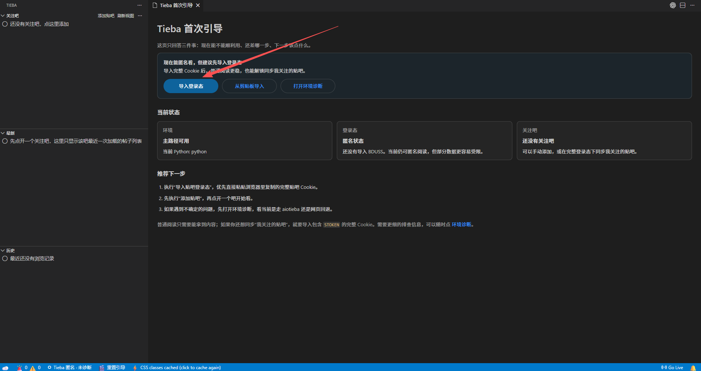
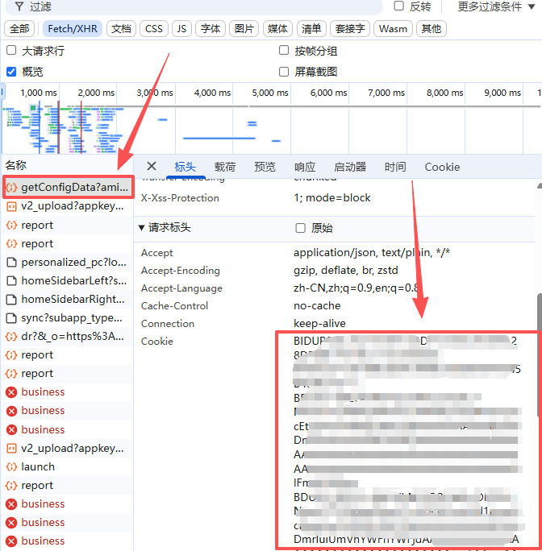
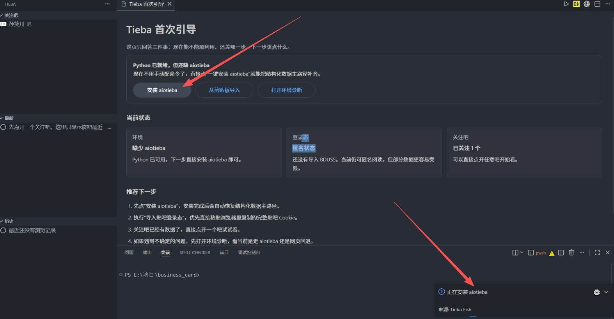

# Tieba Fish

在 VS Code 里低打扰地浏览百度贴吧。

Tieba Fish 不是把贴吧网页原样塞进编辑器，而是尽量用更轻、更像阅读器的方式去看帖子，减少视觉存在感，方便在日常工作流里顺手使用。

## 你能用它做什么

- 在侧边栏查看 `关注吧 / 最新 / 历史`
- 打开帖子，用阅读器样式查看正文
- `只看楼主`
- 展开楼中楼，并支持楼中楼分页
- 查看图片缩略图，点击看大图
- 在帖子底部直接跳页
- `继续阅读`
- `浏览指定链接`
- `Ctrl+Alt+X` 老板模式

## 功能预览

### 首次引导

第一次打开时，插件会告诉你当前能不能直接用、还缺什么、下一步该点什么。



### 登录态导入

推荐直接从浏览器里复制完整贴吧 Cookie，再导入到插件里。



### 一键安装 aiotieba

如果机器上已经有 Python，但还没装 `aiotieba`，可以直接在插件里一键安装。



## 安装方式

### 方式一：扩展市场

在 VS Code 扩展市场搜索：

- `Tieba Fish`

### 方式二：安装 VSIX

如果你拿到的是安装包，可以在 VS Code 里：

1. 打开扩展视图
2. 点击右上角 `...`
3. 选择 `Install from VSIX...`
4. 选择 `.vsix` 文件安装

## 第一次使用

推荐第一次按这个顺序来：

1. 打开命令面板
2. 执行 `导入贴吧登录态`
3. 粘贴浏览器里复制的完整贴吧 Cookie
4. 执行 `同步我关注的贴吧`，或者手动 `添加贴吧`
5. 打开一个吧，再打开帖子开始看

如果你不想手动复制，也可以直接用：

- `从剪贴板导入贴吧登录态`

## 如何导入贴吧登录态

插件推荐直接导入完整贴吧 Cookie。

原因很简单：

- 普通阅读更稳
- 同步“我关注的贴吧”需要完整登录态
- 插件会自动提取 `BDUSS / STOKEN`

### 获取 Cookie 的方式

1. 在浏览器里打开贴吧，并确保自己已经登录
2. 按 `F12` 打开开发者工具
3. 打开 `网络 / Network`
4. 随便点一个贴吧请求
5. 在请求头里找到 `Cookie`
6. 复制完整 Cookie
7. 回到 VS Code，执行 `导入贴吧登录态`

注意：

- 不要只复制一小段字段，尽量整段复制
- 不要把自己的 Cookie 发给别人

登录态会存进 VS Code 的 Secret Storage，本地保存，不会写进普通设置。

## 如果插件提示安装 aiotieba

如果插件提示你还没装 `aiotieba`，可以直接执行：

- `安装 aiotieba`

如果机器上没有 Python，可以先执行：

- `下载 Python`

如果一键安装失败，也可以手动执行：

```powershell
python -m pip install aiotieba
```

装完后重开 VS Code，或者重新打开环境诊断。

## 常用功能

### 关注吧

你可以：

- 手动添加贴吧
- 同步自己账号里已经关注的贴吧
- 点开某个吧，查看帖子列表

### 最新

`最新` 不是全站推荐流。

它显示的是你最近一次打开的关注吧数据，也就是“当前这个吧最近加载出来的帖子列表”，并支持：

- 刷新
- 上一页
- 下一页

### 历史

`历史` 用来记录你最近打开过的帖子，也支持：

- `继续阅读`

### 帖子阅读

打开帖子后，你可以用这些能力：

- `只看楼主`
- 展开楼中楼回复
- 楼中楼分页
- 图片缩略图预览
- 点击查看大图
- 隐藏图片
- 底部跳页
- 回到顶部

### 浏览指定链接

如果你手里已经有贴吧帖子链接，可以直接执行：

- `浏览指定链接`

支持输入：

- 完整帖子链接
- 纯数字帖子 ID

## 老板模式

快捷键：

```text
Ctrl+Alt+X
```

作用：

- 把 Tieba 侧边栏切成伪造文件树
- 把正文页切成伪造代码文件
- 再按一次恢复原来的贴吧内容

适合临时切换视图时快速隐藏当前阅读内容。

## 首次引导和环境诊断

如果插件第一次打开时没有正常工作，可以直接用这几个命令：

- `打开首次引导`
- `打开环境诊断`
- `重置首次引导并重载`

如果你的机器上已经有 Python，也可以直接执行：

- `安装 aiotieba`

如果没有 Python，可以先执行：

- `下载 Python`

## 常用命令

命令面板里常用的有这些：

- `添加贴吧`
- `同步我关注的贴吧`
- `浏览指定链接`
- `继续阅读`
- `导入贴吧登录态`
- `从剪贴板导入贴吧登录态`
- `清除贴吧登录态`
- `打开环境诊断`
- `打开首次引导`
- `安装 aiotieba`
- `下载 Python`
- `重置首次引导并重载`
- `老板键`

## 常见问题

### 1. 能看帖子，但“同步我关注的贴吧”失败

通常是因为只导入了部分登录态。

最稳的方式还是重新执行：

- `导入贴吧登录态`

然后直接粘贴完整贴吧 Cookie。

### 2. 一键安装 aiotieba 失败

可以先手动执行：

```powershell
python -m pip install aiotieba
```

装完后重开 VS Code，或者重新打开环境诊断。

### 3. 为什么有时会回退到浏览器

因为贴吧存在安全校验，插件在部分情况下会回退到浏览器或网页方式继续打开内容。

这属于兜底行为，不代表插件本身损坏。

### 4. 没有 Python 能不能用

可以用一部分功能，但完整体验会更依赖本机 Python 环境。

如果没有 Python，先在命令面板执行：

- `下载 Python`

## 当前特点

相比直接在 VS Code 里打开贴吧网页，这个插件更强调：

- 低打扰阅读
- 正文优先
- 更轻的界面存在感
- 与 VS Code 工作流更贴近的使用方式

## 鸣谢

这个项目的结构化贴吧数据能力，明显受益于 `aiotieba` 项目提供的接口能力和实现思路。

特别感谢：

- `lumina37/aiotieba`
- 项目地址：[https://github.com/lumina37/aiotieba](https://github.com/lumina37/aiotieba)
- 文档地址：[https://aiotieba.cc/](https://aiotieba.cc/)

Tieba Fish 当前的 `Python bridge + aiotieba` 主路径，正是建立在这个项目的能力基础之上。

## 已知限制

- 贴吧本身存在安全校验，个别页面可能仍会失败或回退。
- `最新` 不是推荐流，而是最近一次打开的关注吧数据。
- `只看楼主` 目前更偏向阅读筛选模式，不是独立分页流。
- 部分功能依赖完整登录态和本机 Python 环境。
